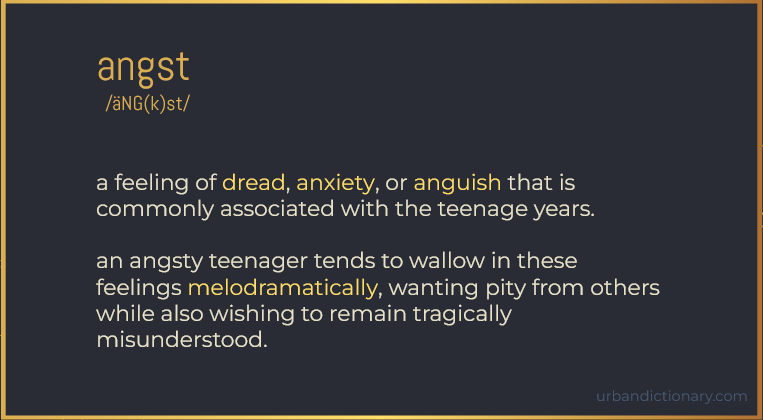

# Angst


  


This repo contains the files used to create my own programming language: Angst
> Note: Angst is not a fully working language yet. This was done for a class project to create an esoteric programming language. However, I may fully develop it in the future.


  

Basically, the idea was that sometimes, programming can be frustrating when you’re stuck on a problem, possibly to the extent that it might make you anxious or dread working on something. This ensures that you will be able to let that inner angst shine while you are coding.

  

As an esoteric language, Angst should have personality. It should be fun. 
However, it is still object oriented and should be capable of being functional.

  

Since the parser and lexer were written in Java, I was already in an object-oriented mindset. Everything is structured as if it were Java, just using our angsty grammar.

It was important when designing Angst to have high read and writability. The code should read like a script. Almost like a teenager pGresenting the code he didn't want to write in front of the class he doesn't care for. 

I also wanted to focus on multiplicy, meaning there were a few different options for words, so that reading it doesn't get too repetative (while only having a maxinum of 3 possibilites to keep readability in mind.)

For example, Booleans and EndOfStatement variables all had 3 options:

```html
ugh this is a comment

ugh TRUE booleans:
my bool a should be cool;
my bool b should be rad;
my bool c should be sick;

ugh FALSE booleans:
my bool d should be meh;
my bool e should be bleh;
my bool f should be eh;

ugh EndOfStatements:
my number w should be 8 or whatever
my number x should be 13 i guess
my number y should be 4 but who cares
my number z should be 18;
```


---
# Example Code

## White space
White space does not matter. You can indent if you feel like it. Nothing matters anyway.

## Comments
- Comments are defined using ```ugh```
```
ugh this is a comment
```
## Beginning / Ending an Angst File
At the beginning of your file, you must begin with 
``` hear me out.. ```

To end the file, add
``` thats deep. ```

## Scope, Variables, and Assignment 
- **Private** variables are declared using ```my```
- **Public** variables are declared using ```anybodies```

---
- **Nulls** are indicated using ```nada```
- **Strings** are defined using ```stringy```
- **Integers** are defined using ```number```
- **Booleans** are defined using ```bool```
- **Arrays** are indicated using ```buncha```
---
- **Equal (=)**  :  ```should be```
- **Not (!)**  :  :  ```NOT!```
> *Note, NOT! contains the only capital letters that show up in Angst. Ever.*
```
my number x should be 7;
anybodies stringy y should be "hello";
my bool z should be cool;
my buncha numbers should be [1, 3, 5, 7]
```

## Loops
- **If**  :  ```as if```
- **Else If**  :  ```unless..```
- **Else**  :  ```but whatever```
- **Do**  :  ```do i hafta```
- **While**  :  ```even if```
- **END LOOP**  :  ```yech``` 
>*"yech" sounds kinda that clearing your throat sound that shows up in german)*
```
as if flag is bleh
    ugh some code here

unless.. flag is rad
    ugh some different code here

but whatever
    ugh just do this

yech

## Try/Catch Statements
- **Try**  :  "maybe"
- **Catch**  :  "or not."
- **THROW EXCEPTION**  :  "throw shade {exception}"
- 
```

## Print Statement
The print statement function ```mumble``` is built into Angst, much like print() in other languages. 

```
mumble x i guess
```

## Random Number Generation
The random number function ```anxious```

```
my number y should be anxious or whatever
```